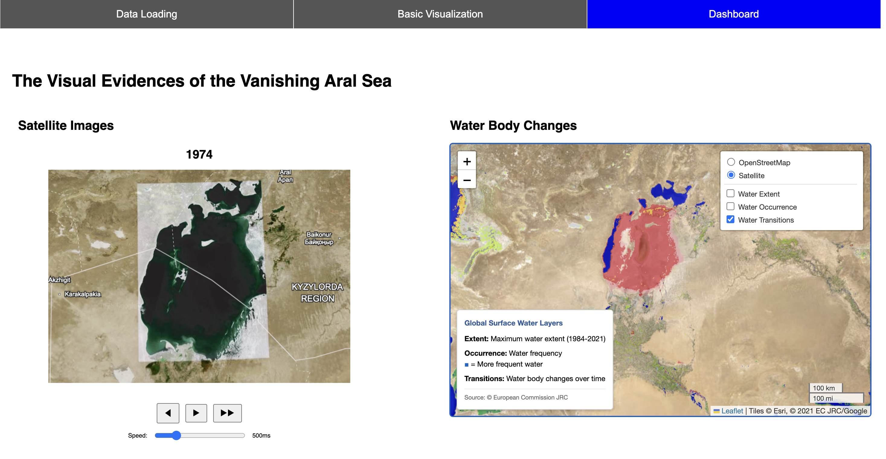
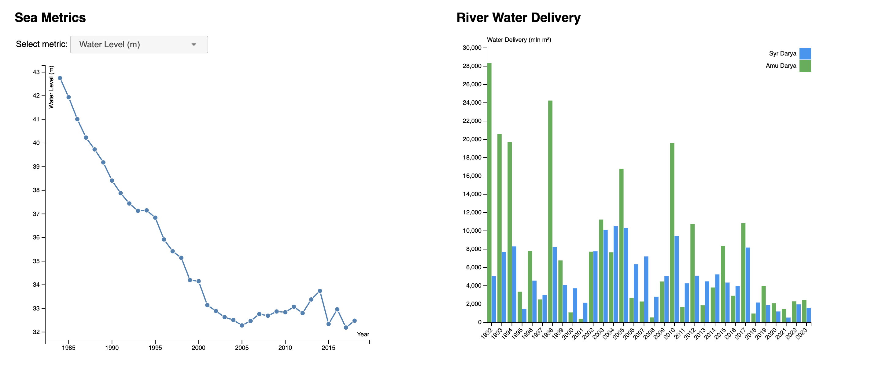
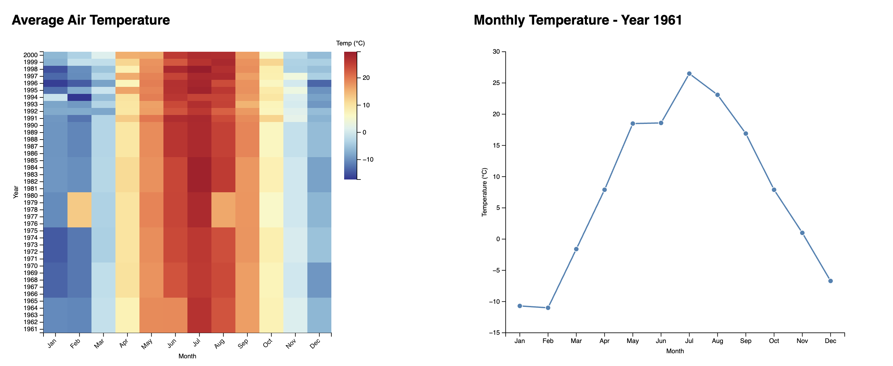

# Visual Evidence of the Vanishing Aral Sea

A comprehensive data visualization project for analyzing the environmental changes of the Aral Sea, created for the Data Visualization course at the University of Passau.

## Authors

- **Javokhirbek Mirzaakbarov** - mirzaa02@ads.uni-passau.de
- **Jelaleddin Sultanov** - sultan05@ads.uni-passau.de

## Overview

This project presents a multi-faceted visualization of the Aral Sea's environmental degradation from 1961 to 2023. The framework combines satellite imagery, statistical data, and interactive visualizations to tell the story of one of the world's most significant environmental disasters.

## Screenshots

### Dashboard Overview





_The main dashboard showing all visualization components including satellite timelapse, water body map, sea metrics line chart, river water delivery bar chart, temperature heatmap, and monthly temperature analysis._

## Table of Contents

- [Screenshots](#screenshots)
- [Architecture](#architecture)
- [Features](#features)
- [Data Sources](#data-sources)
- [Installation & Usage](#installation--usage)
- [File Structure](#file-structure)
- [Visualization Components](#visualization-components)
- [Technical Implementation](#technical-implementation)
- [Browser Compatibility](#browser-compatibility)

## Architecture

The application follows a modular architecture with three main components:

### 1. Core Framework (`dataVis.js`)

- **Data Loading**: Handles CSV file parsing and data preprocessing
- **Basic Visualizations**: Implements scatterplot and radar chart functionality
- **Interaction Management**: Manages data point selection and highlighting
- **Menu System**: Dynamic dropdown menus for dimension selection

### 2. Dashboard System (`dashboard.js`)

- **Specialized Visualizations**: Line charts, bar charts, heatmaps, and timelapse
- **Data Integration**: Combines multiple datasets (sea metrics, river data, temperature)
- **Advanced Features**: Interactive satellite imagery timeline and geographic mapping

### 3. User Interface (`index.html`, `style.css`)

- **Tab-based Navigation**: Three main sections (Data Loading, Basic Visualization, Dashboard)
- **Responsive Layout**: Grid-based dashboard layout with flexible containers
- **Interactive Controls**: File upload, dropdown menus, and chart controls

## Features

### Data Loading & Management

- **CSV File Upload**: Support for custom dataset loading
- **Data Table View**: Interactive tabular representation of loaded data
- **Data Validation**: Automatic detection of numeric vs categorical dimensions

### Basic Visualizations

- **Interactive Scatterplot**:
  - Configurable X/Y axes and point sizing
  - Data point selection for detailed analysis
  - Hover tooltips with detailed information
- **Multi-dimensional Radar Chart**:
  - Up to 10 selectable data points
  - Color-coded visualization with legend
  - Normalized scaling across dimensions

### Dashboard Visualizations

- **Sea Metrics Line Chart**: Time series analysis of water level, surface area, and volume
- **River Water Delivery Bar Chart**: Comparative analysis of Amu Darya and Syr Darya rivers
- **Temperature Heatmap**: Monthly temperature patterns across years (1961-2020)
- **Monthly Temperature Line Chart**: Detailed temperature analysis for selected years
- **Satellite Timelapse**: Interactive progression of Aral Sea changes (1974-2020)
- **Geographic Map**: Leaflet-based mapping with water body overlays

## Data Sources

### Primary Datasets

1. **`1984_2018_metrics.csv`**: Core Aral Sea measurements

   - Water Level (meters)
   - Surface Area (km²)
   - Volume (km³)

2. **`water_delivery_1992_2023.csv`**: River water delivery data

   - Amu Darya and Syr Darya rivers
   - Growing/Non-growing season data
   - Total annual delivery volumes

3. **`av_temperature.csv`**: Regional temperature data (1961-2020)

   - Monthly average temperatures
   - Roman numeral month notation (I-XII)

4. **`screenshots/`**: Satellite imagery collection
   - Annual satellite images (1974-2020)
   - PNG format for timelapse visualization

### Test Datasets

- **`TestData/`**: Sample datasets for testing functionality
  - `cars.csv`, `flowers.csv`, `nutrients.csv`

## Installation & Usage

### Prerequisites

- Modern web browser with JavaScript enabled
- Local web server (recommended for file loading)

### Setup

1. Clone or download the project files
2. Start a local web server in the project directory:

   ```bash
   # Using Python 3
   python -m http.server 8000

   # Using Node.js
   npx serve .
   ```

3. Open `http://localhost:8000` in your browser

### Usage Flow

1. **Data Loading Tab**: Upload CSV files or use default datasets
2. **Basic Visualization Tab**: Explore data with scatterplot and radar chart
3. **Dashboard Tab**: Access comprehensive Aral Sea analysis

## File Structure

```
dataVis_2024_framework/
├── index.html              # Main application interface
├── dataVis.js             # Core visualization framework
├── dashboard.js           # Dashboard-specific functionality
├── style.css              # Application styling
├── README.md              # Project documentation
├── datasets/              # Data files
│   ├── 1984_2018_metrics.csv
│   ├── water_delivery_1992_2023.csv
│   ├── av_temperature.csv
│   └── screenshots/       # Satellite images (1974-2020)
└── TestData/              # Sample datasets
    ├── cars.csv
    ├── flowers.csv
    └── nutrients.csv
```

## Visualization Components

### Line Chart System

- **Dynamic Y-axis selection**: Switch between water level, surface area, and volume
- **Smooth transitions**: 500ms animated updates
- **Interactive tooltips**: Hover for detailed data points
- **Responsive scaling**: Automatic padding and domain adjustment

### Bar Chart Implementation

- **Grouped bars**: Side-by-side river comparison
- **Color coding**: Distinct colors for Amu Darya and Syr Darya
- **Legend system**: Interactive legend with river identification
- **Hover effects**: Detailed tooltip information

### Heatmap Visualization

- **Color scaling**: Blue-red diverging scale for temperature
- **Interactive selection**: Click cells to update line chart
- **Month ordering**: Proper chronological display (Jan-Dec)
- **Year filtering**: Focus on specific time periods

### Timelapse Controller

- **Playback controls**: Play, pause, previous, next
- **Speed adjustment**: Variable playback speed (100-2000ms)
- **Manual navigation**: Year slider for direct access
- **Image preloading**: Smooth transitions between frames

## Technical Implementation

### Libraries & Dependencies

- **D3.js v7**: Data visualization and DOM manipulation
- **jQuery 3.6.1 & jQuery UI 1.13.2**: User interface components
- **Leaflet 1.9.4**: Interactive mapping functionality

### Key Design Patterns

- **Observer Pattern**: Menu selections trigger visualization updates
- **Module Pattern**: Separate concerns between core and dashboard functionality
- **Data Binding**: D3.js data-driven DOM manipulation
- **Event Delegation**: Efficient event handling for dynamic elements

### Performance Optimizations

- **Image Caching**: Preload satellite images for smooth timelapse
- **Transition Management**: Coordinated animations with consistent timing
- **Data Preprocessing**: Efficient data structures for fast rendering
- **Selective Updates**: Only redraw necessary visualization components

### Responsive Design

- **Grid Layout**: CSS Grid for flexible dashboard arrangement
- **Scalable Graphics**: SVG-based visualizations that scale with containers
- **Breakpoint Considerations**: Layout adjustments for different screen sizes

## Browser Compatibility

### Tested Browsers

- Chrome 90+ (Recommended)
- Firefox 88+
- Safari 14+
- Edge 90+

### Known Limitations

- IE11 and below: Not supported (requires ES6+ features)
- Mobile browsers: Limited interaction support
- File loading: Requires local server for CORS compliance

## Development Notes

### Code Organization

- **Separation of Concerns**: Clear distinction between data visualization and dashboard functionality
- **Global State Management**: `window.currentData` for cross-module data sharing
- **Error Handling**: Graceful degradation for missing data or failed loads
- **Documentation**: Comprehensive inline comments and function documentation

### Extension Points

- **Custom Datasets**: Easy integration of new CSV data sources
- **Additional Visualizations**: Modular structure supports new chart types
- **Styling Customization**: CSS variables and classes for theme modifications
- **Data Processing**: Extensible data transformation pipeline

### Future Enhancements

- **Real-time Data**: Integration with live data sources
- **Export Functionality**: Save visualizations as images or PDFs
- **Advanced Filtering**: Time range and data subset selection
- **Animation Controls**: Enhanced timeline and playback features

---

_This project demonstrates the power of data visualization in environmental storytelling, combining historical data, satellite imagery, and interactive elements to document the Aral Sea's transformation over six decades._
